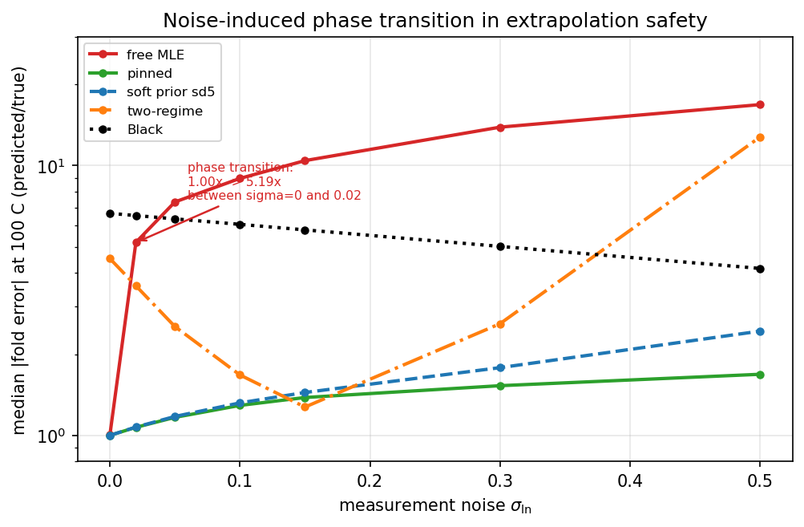
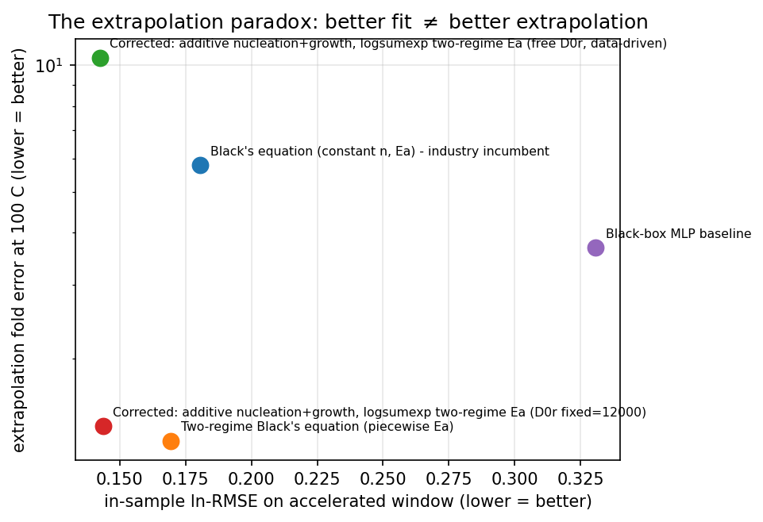
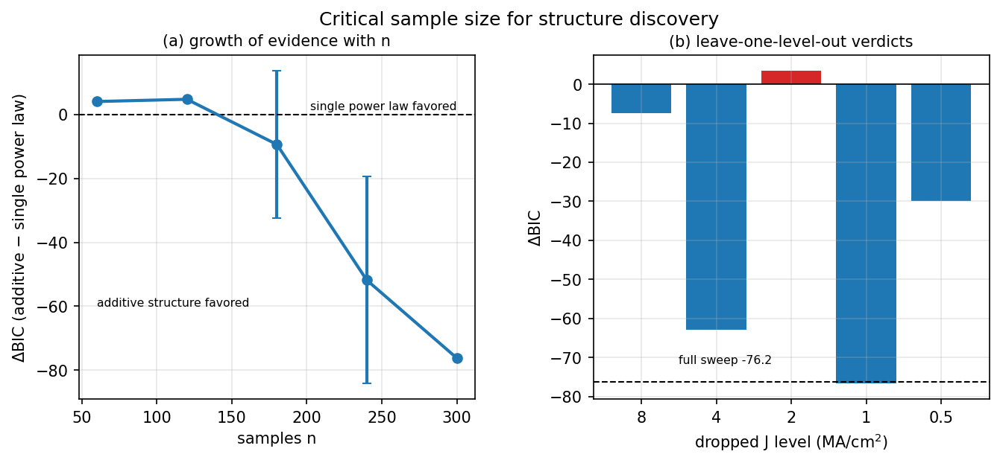
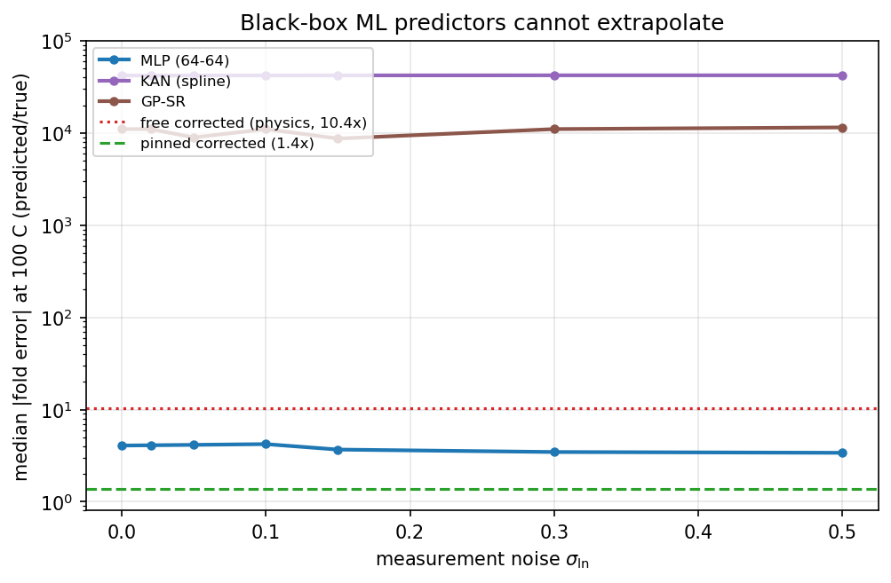

# EMBench-Synth: Electromigration Equation-Discovery Benchmark

A deterministic, fully-controlled synthetic benchmark for **physics-informed
equation discovery** on chip-interconnect reliability data.

The industry-standard **Black's equation** `MTTF = A J^-n exp(Ea/kT)` extrapolates
accelerated electromigration tests to use conditions with a *constant* activation
energy and current exponent. Real interconnects violate both assumptions. This
package encodes the three physics corrections the incumbent lacks, hides them
from every model behind a *blind* CSV, and measures how well each approach
recovers them:

1. **Fractional current exponent** — `MTTF ∝ (B0 J^-2 + C0 J^-1)`, so
   `n_eff(J)` interpolates between 2 (nucleation) and 1 (growth).
2. **Two-pathway activation energy** — `D_eff(T) = Σ_p D0_p exp(-Ea_p/kT)`
   (surface + grain-boundary), so `Ea_eff(T)` crosses over smoothly
   (true crossover 494.2 K / 221 °C).
3. **Blech immortality** — wires with `jL ≤ (jL)_c = 3000 A/cm` never fail;
   MTTF diverges as `jL → (jL)_c⁺`.

The corrected equation is
```
MTTF(T,J,L) = (B0 J^-2 + C0 J^-1)/D_eff(T) · jL/(jL - (jL)_c)
```

## Headline results (see `paper/` and `results/results.json`)

**New deployment-identifiability result.** A free corrected-equation fit on
the accelerated window has a median **5.35x** use-condition error across 20
seeds at `sigma_ln = 0.15`, despite being the best in-window fitter. A
deployment-conditioned Fisher diagnostic selects one additional five-current
temperature batch; the selected batch reduces the deployment lever by **97.9%**
median, reduces median fold error to **1.47x**, and reaches the 2x safety target
in **85%** of seeds versus **50%** for a random candidate batch. Results are in
`results/deployment_identifiability.json`; figures are
`figures/fig_deployment_identifiability.png` and
`figures/fig_adaptive_test_design.png`.

Novelty is tracked explicitly in `research/novelty_scorecard.md`. The current
parameter-information and deployment-functional policies select the same batch
on the present candidate set, so the stronger distinction between those
objectives is not yet claimed as a discovery.

**Current discovery candidate.** An optimizer-independent parameter tradeoff
family produces nearly indistinguishable accelerated predictions (maximum
0.15 log units across three pathway settings) but deployment disagreements of
up to **15.97x** when the
training window is restricted to `T >= 623 K`. The frontier is in
`results/nonidentifiability_frontier.json` and
`paper/figures/fig_nonidentifiability_frontier.png`; it is provisional pending
prior-art and external-validation review.

**Deployment-safety certificate.** The new certificate retains the compatible
tradeoff family and asks whether one additional five-current batch can reduce
worst-case deployment disagreement below 2x. Across 20 seeds, the accelerated
fit starts at a median **91.8x** compatible-set disagreement; the certificate
policy reduces this only to **88.4x**, with **100% ABSTAIN** decisions. This is
a falsifiable design rule: the current accelerated window and one extra batch
do not support a 2x deployment sign-off under the stated compatibility budget.
The machine-readable result and plot are in
`results/deployment_safety_certificate.json` and
`paper/figures/fig_deployment_safety_certificate.png`.

| Benchmark | Incumbent Black's | Corrected equation |
|---|---|---|
| Generalization (held-out T / J / L splits) | 0.21–0.65 ln-RMSE | **0.14–0.17** |
| Extrapolation accelerated → 100 °C (base) | **5.8× off** (over-predicts) | **1.4×** |
| Extrapolation with length dependence | **7.1× off** | **1.17×** |
| Recovery of Ea_eff(T) / crossover / n_eff(J) / (jL)_c | — | 0.079 eV / 2.3 K / 0.057 / 0.05% |
| Structural discovery (BIC: additive vs single power law) | — | Δ = −76.2 |
| Spline KAN decomposition R² (σ_ln floor ≈ 0.98) | — | 0.997 |
| GP symbolic regression R² (36-node opaque program) | 0.862 | — |



**The extrapolation paradox (headline result).** In-sample fit quality on the
accelerated window is *inversely* predictive of use-condition accuracy:

| Model | In-sample ln-RMSE | Extrapolation fold at 100 °C |
|---|---|---|
| Corrected, free D0r (data-driven) | **0.142** (best fit) | **10.4×** (worst) |
| Corrected, D0r pinned at material value | 0.144 | **1.4×** |
| Two-regime Black's | 0.169 | 1.27× base, **5.2× with length** |
| Black's equation | 0.181 | 5.8× |
| Black-box MLP | 0.331 | 3.7× (wrong sign) |
| Physics-regularized MLP (corrected-eq. output + soft prior) | 0.162 | **1.49×** |

A free prefactor ratio absorbs the surface pathway into a degenerate,
unphysical direction (Ea_s = 0.54 eV, D0r = 3×10⁶, at bounds); pinning that one
measured constant costs 0.001 ln-RMSE and is worth a 7.5× extrapolation
improvement.



**Critical sample size for structure discovery (secondary result).** At
σ_ln = 0.15 the J⁻²+J⁻¹ structure is statistically forced only by the full
five-current grid (ΔBIC = −76, 20/20 draws). With 1–2 J levels it is
unidentifiable; with 3–4 it is a lottery (70–75%). One level is load-bearing —
dropping the geometric-mean current J = 2.0 MA/cm² flips ΔBIC from −63 to +3.3.
Coverage, not count, sets the minimum test cells.



Black-box MLP: best on random splits, but 2.9–3.7× OOD extrapolation error with
the wrong sign. Shuffled negative control recovers 2.34 eV vs the real 0.064 eV
(no hallucination). A **physics-regularized MLP** — MLP output structured as the
corrected equation plus a soft prior toward literature parameters — is the
positive ML arm: 1.07–1.60× across the σ_ln sweep (1.49× at σ_ln = 0.15 on the
released leaderboard), showing the constraint, not model class, transfers.



**The noise-induced phase transition (secondary diagnostic).**
Extrapolation safety is not a continuous function of noise — it collapses
discontinuously at σ_ln = 0.02:

| σ_ln | 0 | 0.02 | 0.05 | 0.1 | 0.15 | 0.3 | 0.5 |
|---|---|---|---|---|---|---|---|
| Corrected, free D0r | 1.00 | **5.19** | 7.33 | 8.97 | 10.44 | 13.89 | 16.84 |
| Corrected, pinned D0r | 1.00 | 1.07 | 1.17 | 1.29 | 1.38 | 1.53 | 1.69 |
| Corrected, soft prior | 1.00 | 1.07 | 1.18 | 1.32 | 1.44 | 1.78 | 2.44 |
| Two-regime Black's | 4.53 | 3.59 | 2.53 | 1.68 | 1.27 | 2.60 | 12.78 |
| Black's equation | 6.66 | 6.53 | 6.35 | 6.06 | 5.78 | 5.02 | 4.16 |

Fold = extrapolation error at 100 °C relative to zero-noise. Mechanism
(singular-model geometry, Watanabe): the free model's extrapolation functional
is aligned with the smallest eigenvalue of the Fisher information at the truth —
ill-conditioned by 10⁹–10¹², 99.4% of extrapolation variance carried by that one
direction. As the accelerated window deepens (T ≥ 548 K) the direction becomes
*exactly flat* (ΔRSS = 0 to machine precision, span 0.0000 eV): invisible at any
sample size. A single pinned physics constant removes it (lever ratio
free/pinned 296× → 2388×).

**In-window certification is impossible.** The profile-likelihood width of the
hazard direction is 0.13 eV with an *exact* hazard of 10.4×; at deep windows the
width is 0.0000 eV with a 10.3× hazard (the pinned model collapses too — an
information limit, not an optimizer failure). A data-side width cannot detect a
geometry-side singularity.

**Extrapolation law (quantitative transfer).** `ΔEa_transfer`: Black +0.228,
two-regime +0.065, free −0.278, pinned −0.028 eV. Safe-to-2× temperature:
460.0 / 353.2 / 470.2 / **248.1 K** — the pinned model is safe all the way to
use conditions.

## Layout

```
generate_dataset.py                 # corrected-equation physics + deterministic data (seed 42)
benchmarks/
  models.py                         # BlackMLE, TwoRegime, Corrected (Additive/AdditiveBlech), MLP
  recovery.py                       # Ea_eff(T), n_eff(J), (jL)_c, negative control
  sr.py                             # GP symbolic regression + BIC structure test
  kanlite.py                        # single-layer spline KAN (physics-init + residual variants)
  eval.py                           # extrapolation, generalization, robustness sweeps
  deployment_identifiability.py    # deployment lever + adaptive temperature-batch design
deployment_safety_certificate.py # robust compatible-set sign-off certificate
  figures.py                        # paper figures
  run_all.py                        # runs everything -> results/results.json, figures/
prototype_phase_transition.py       # reproduces Table 2 (noise sweep) exactly
prototype_rlct.py                   # Fisher spectrum + extrapolation lever at the truth
prototype_improved.py               # paradox, soft prior, envelope depth
prototype_diagnostic.py             # profile-likelihood hazard widths (Table 6)
prototype_quantitative.py           # extrapolation law + sample-size laws
data/                               # blind CSVs, ground-truth CSVs, splits/, metadata
results/results.json                # all benchmark numbers (14 keys incl. phase_transition)
figures/*.png                       # 10 figures
results/deployment_identifiability.json # 20-seed deployment-design experiment
paper/paper.tex, paper/paper.md     # NeurIPS-2026 workshop paper (LaTeX + markdown)
paper/figures/*.png                 # synchronized paper figures
```

## Quickstart

```bash
# 1. (optional) regenerate the data deterministically
python generate_dataset.py

# 2. run the full benchmark suite (~70 s)
python benchmarks/run_all.py

# 3. inspect outputs
cat results/results.json            # all numbers
ls figures/                         # figures

# 4. (optional) reproduce individual paper tables
python prototype_phase_transition.py    # Table 2 (noise sweep)
python prototype_rlct.py               # Table 3 (Fisher spectrum, lever)
python prototype_diagnostic.py         # Table 6 (profile-likelihood widths)
python prototype_quantitative.py       # Table 5 + sample-size laws
python3 benchmarks/deployment_identifiability.py  # deployment ambiguity + adaptive test design
python3 benchmarks/deployment_safety_certificate.py  # robust deployment sign-off certificate
```

## NeurIPS 2026 submission

Research track of the *AI for Chip Design* workshop (Dec 12 2026, Paris):
submission deadline **Aug 30 2026 AoE**, notification Sep 29, camera-ready
Oct 9. Archival, double-blind (`neurips_2026.sty`, `dblblindworkshop`).
`paper/paper.tex` is the canonical manuscript source. The added deployment
section and figures require a final LaTeX compilation to re-check the workshop
page limit; the container currently has no TeX compiler installed.

## Environment

Python 3.10+. `numpy`, `pandas`, `scipy`, `scikit-learn`, `matplotlib`,
`gplearn`, `torch`. (pykan is **not** used — it is incompatible with numpy 1.26;
a compact spline KAN `kanlite.py` is used instead.)

## Physics in one place

| Symbol | Meaning | Value |
|---|---|---|
| B0 / C0 | nucleation / growth terms (α = 0.30) | 3.74e-6 / 1.122e-6 |
| Ea_s / Ea_gb | surface / grain-boundary activation | 0.8 / 1.2 eV |
| D0_gb/D0_s | prefactor ratio | 1.2e4 |
| T_c | Ea crossover | 494.2 K |
| (jL)_c | Blech critical product | 3000 A/cm |
| T range | tested envelope | 443–698 K (170–425 °C) |
| noise | log-normal σ_ln | 0.15 (seed 42) |

The bulk pathway (Ea_b = 2.3 eV) exists in the physics but lies **outside** the
sampled window and is deliberately not claimed recoverable.

**External physics validation.** The governing physics was chosen to match
published electromigration behavior, not assumed ad hoc: stress T 200–350 °C
and J ≈ 2–4 MA/cm² [Arnaud et al., Microelectron. Eng. 2013]; measured current
exponents that *vary* between ~1 and 2 (Cu: 1.55→1.15, Cu(Mn): 2.00→1.64)
[Gall et al., IEEE IRPS 2013]; activation energies reaching ≈1.4 eV that depend
on mechanism/current density. These motivate the additive J⁻²+J⁻¹ form and the
two-pathway Ea_eff(T) in EMBench-Synth. The comparison validates the *physics
assumptions*, not the singular-model geometry results.
