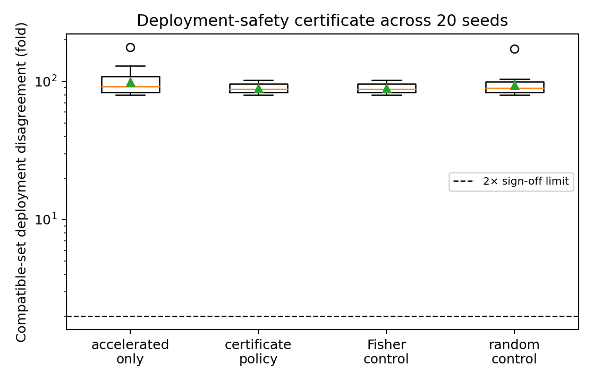

# Deployment Non-Identifiability in AI-Based Electromigration Reliability Prediction

**EMBench-Synth** — a deterministic synthetic benchmark for AI-assisted electromigration reliability and chip sign-off.

## Abstract

Accelerated electromigration (EM) tests are routinely extrapolated to use conditions, where errors can affect power-delivery-network guard bands. We study a deployment-identifiability limit: physically distinct corrected-equation parameters can agree in the accelerated temperature envelope while disagreeing at use conditions. An optimizer-independent tradeoff family reaches 15.97× hidden deployment disagreement while staying within 0.15 log-lifetime units of the accelerated data for the deepest tested window.

We introduce a robust compatible-set certificate. It reports the worst disagreement among parameterizations compatible with the accelerated predictions and returns `SAFE` only when that disagreement is at most 2×; otherwise it returns `ABSTAIN`. Across 20 noise seeds, the accelerated-only certificate has 91.8× median disagreement. The best one-batch policy reduces this to 88.4×, but all certificate-directed, Fisher, and random policies abstain. A separate local-lever experiment reduces point-prediction error from 5.35× to 1.47×, but its deployment and parameter-information policies select the same batch on the present candidate grid. Our main contribution is therefore a falsifiable boundary on data-only sign-off, not a claim that one adaptive test can manufacture missing deployment information.

## 1. Benchmark and physical model

The benchmark generates lifetime from

```text
MTTF(T,J,L) = (B0 J^-2 + C0 J^-1) / Deff(T) · jL/(jL − (jL)c)
Deff(T) = Σp D0,p exp(−Ea,p/(kB T)).
```

It encodes additive void nucleation and growth, parallel surface/grain-boundary/bulk diffusion, and Blech critical-product immortality. The dataset is synthetic by design: recovery experiments test whether methods can identify the encoded structure, while deployment experiments test extrapolation and uncertainty behavior.

## 2. Deployment-non-identifiability frontier

For each truth scenario, shift `ln B0`, `ln C0`, and `ln(D0,gb/D0,s)` by the same amount. In the grain-boundary-dominated accelerated regime these shifts nearly cancel, but they change the low-temperature prediction where the surface pathway reappears. We sweep this family without an optimizer or noisy fitting step.

With a 0.15 log-lifetime compatibility threshold, the maximum hidden deployment disagreement is:

| Accelerated window | Maximum compatible deployment disagreement |
|---|---:|
| T ≥ 523 K | 1.53× |
| T ≥ 548 K | 1.84× |
| T ≥ 573 K | 2.75× |
| T ≥ 623 K | 15.97× |

The construction is repeated for low-, benchmark-, and high-prefactor-ratio pathway scenarios. This is the strongest current discovery candidate, but it remains a benchmark finding until external or digitized EM data confirm the mechanism.

## 3. Robust deployment-safety certificate

Let `Theta_tau` be the members of the tradeoff family whose total squared prediction deviation from the fitted accelerated model is at most `5 sigma^2`. Define

```text
Delta_use = max(theta, theta' in Theta_tau, j in J_use)
            |log MTTF_theta(Tuse,j) − log MTTF_theta'(Tuse,j)|.
```

The certificate is `SAFE` if `exp(Delta_use) ≤ 2`; otherwise it is `ABSTAIN`. The compatibility budget is fixed across sequential experiments, so adding rows cannot enlarge the prediction-space compatible set.

Across 20 seeds at `sigma_ln = 0.15`:

| Policy | Median worst-case disagreement | Abstain rate |
|---|---:|---:|
| Accelerated only | 91.8× | 100% |
| Certificate-directed batch | 88.4× | 100% |
| Fisher control | 88.4× | 100% |
| Random control | 89.5× | 100% |

The result is deliberately negative and falsifiable: under this ambiguity family and test budget, one additional batch cannot support a 2× deployment sign-off. The appropriate output is abstention, followed by multi-stage testing or an independently measured material constraint.



## 4. Secondary adaptive test-design result

The local deployment lever

```text
L_use = tr[H_use (G_acc^T G_acc)^+ H_use^T]
```

is useful for ranking candidate batches, but it is not a certificate. On the current six-temperature candidate set, the deployment-functional and parameter-information policies both select 443 K. Across 20 seeds, the local-lever experiment reports 5.35× median accelerated-only point error, 1.47× after the selected batch, and 1.94× after a random batch. Because the two objectives choose the same action, we do not claim that deployment-functional design is a distinct discovery here.

## 5. Relation to AI for Chip Design

The benchmark is relevant to AI-assisted chip reliability because a learned lifetime model may be used to rank vulnerable PDN segments or set guard bands outside its training envelope. In this setting, in-window RMSE and parameter uncertainty are insufficient acceptance criteria. A sign-off system should expose an explicit compatible-set disagreement and abstain when the deployment decision is not identified.

## 6. Limitations and claim boundary

The data are synthetic and encode the corrected equation. The certificate family is physically motivated but not exhaustive, and the `5 sigma^2` budget is a stated empirical protocol rather than a calibrated frequentist coverage guarantee. The current experiments use one additional batch and do not establish the result on measured EM data, unseen materials, or real PDN topologies. We therefore claim a reproducible benchmark-level discovery candidate, not a universal impossibility theorem or production sign-off guarantee.

## 7. Reproduction

```bash
python benchmarks/nonidentifiability_frontier.py
python benchmarks/deployment_identifiability.py
python benchmarks/deployment_safety_certificate.py
python benchmarks/run_all.py
```

The first three commands regenerate the frontier, adaptive-design, certificate JSON files, and figures. The full suite additionally requires the dependencies in `requirements.txt`.

## References

The canonical, citation-ordered bibliography is maintained in [`paper.tex`](paper.tex). It includes Black (1969), JEDEC JEP122H, the EM physics references for diffusion and Blech behavior, Watanabe's singular-learning framework, equation-discovery methods, and the closest EM accelerated-test/data-collection work.
